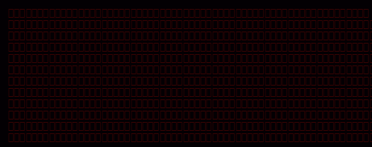

<div align="center">



<br>

`// the-lust`

<br>


<br><br>

<a href="https://discord.com/users/nanami.sai"></a>
&nbsp;


</div>

<br>

<table width="100%">
<tr>
<td width="52%" valign="top">

```
// about

⬥  femboy  ·  cosplay  ·  crossdress
⬥  pizza  ·  strawberry boba milk tea
⬥  assassin's creed  ·  cod  ·  gamer
⬥  anime  ·  manga  ·  kdrama  ·  films
⬥  football (soccer)  ·  badminton
⬥  scared of ghosts
─────────────────────────────────────
⬥  rux contributor  ·  tool research
⬥  reverse eng  ·  drm  ·  asm basics
⬥  windows hypervisor research
⬥  c++  >  c#  >  java  >  py  >  rust
⬥  discord  ·  nanami.sai
```

</td>
<td width="48%" valign="top" align="center">

<pre style="font-weight:bold;font-family:monospace;background:transparent;border:none;color:#cc2200;line-height:1;padding:0;margin:0;">
⠀⠀⠀⠀⡀⠀⠀⣀⠀⠀⠀⠀⠀⠀⠀⠀⠀⠀⠀⠀⠀⠀⠀⠀⠀⠀⠀⠀⠀⠀⡀⠀⠀⠀⠀⠀⠀⠀⠀⠀⠀⠀⠀⠀⠀⠀⡀⠀⠀⠀⠀⠀⠀⡀⠀⠀⠀⠀⠀⠀⠀⠀
⠀⢸⠉⣹⠋⠉⢉⡟⢩⢋⠋⣽⡻⠭⢽⢉⠯⠭⠭⠭⢽⡍⢹⡍⠙⣯⠉⠉⠉⠉⠉⣿⢫⠉⠉⠉⢉⡟⠉⢿⢹⠉⢉⣉⢿⡝⡉⢩⢿⣻⢍⠉⠉⠩⢹⣟⡏⠉⠹⡉⢻⡍⡇
⠀⢸⢠⢹⠀⠀⢸⠁⣼⠀⣼⡝⠀⠀⢸⠘⠀⠀⠀⠀⠈⢿⠀⡟⡄⠹⣣⠀⠀⠐⠀⢸⡘⡄⣤⠀⡼⠁⠀⢺⡘⠉⠀⠀⠀⠫⣪⣌⡌⢳⡻⣦⠀⠀⢃⡽⡼⡀⠀⢣⢸⠸⡇
⠀⢸⡸⢸⠀⠀⣿⠀⣇⢠⡿⠀⠀⠀⠸⡇⠀⠀⠀⠀⠀⠘⢇⠸⠘⡀⠻⣇⠀⠀⠄⠀⡇⢣⢛⠀⡇⠀⠀⣸⠇⠀⠀⠀⠀⠀⠘⠄⢻⡀⠻⣻⣧⠀⠀⠃⢧⡇⠀⢸⢸⡇⡇
⠀⢸⡇⢸⣠⠀⣿⢠⣿⡾⠁⠀⢀⡀⠤⢇⣀⣐⣀⠀⠤⢀⠈⠢⡡⡈⢦⡙⣷⡀⠀⠀⢿⠈⢻⣡⠁⠀⢀⠏⠀⠀⠀⢀⠀⠄⣀⣐⣀⣙⠢⡌⣻⣷⡀⢹⢸⡅⠀⢸⠸⡇⡇
⠀⢸⡇⢸⣟⠀⢿⢸⡿⠀⣀⣶⣷⣾⡿⠿⣿⣿⣿⣿⣿⣶⣬⡀⠐⠰⣄⠙⠪⣻⣦⡀⠘⣧⠀⠙⠄⠀⠀⠀⠀⠀⣨⣴⣾⣿⠿⣿⣿⣿⣿⣿⣶⣯⣿⣼⢼⡇⠀⢸⡇⡇⡇
⠀⢸⢧⠀⣿⡅⢸⣼⡷⣾⣿⡟⠋⣿⠓⢲⣿⣿⣿⡟⠙⣿⠛⢯⡳⡀⠈⠓⠄⡈⠚⠿⣧⣌⢧⠀⠀⠀⠀⠀⣠⣺⠟⢫⡿⠓⢺⣿⣿⣿⠏⠙⣏⠛⣿⣿⣾⡇⢀⡿⢠⠀⡇
⠀⢸⢸⠀⢹⣷⡀⢿⡁⠀⠻⣇⠀⣇⠀⠘⣿⣿⡿⠁⠐⣉⡀⠀⠁⠀⠀⠀⠀⠀⠀⠀⠀⠉⠓⠳⠄⠀⠀⠀⠀⠋⠀⠘⡇⠀⠸⣿⣿⠟⠀⢈⣉⢠⡿⠁⣼⠁⣼⠃⣼⠀⡇
⠀⢸⠸⣀⠈⣯⢳⡘⣇⠀⠀⠈⡂⣜⣆⡀⠀⠀⢀⣀⡴⠇⠀⠀⠀⠀⠀⠀⠀⠀⠀⠀⠀⠀⠀⠀⠀⠀⠀⠀⠀⠀⠀⠀⢽⣆⣀⠀⠀⠀⣀⣜⠕⡊⠀⣸⠇⣼⡟⢠⠏⠀⡇
⠀⢸⠀⡟⠀⢸⡆⢹⡜⡆⠀⠀⠀⠀⠀⠀⠀⠀⠀⠀⠀⠀⠀⠀⠀⠀⠀⠀⠀⠀⠀⠀⠀⠀⠀⠀⠀⠀⠀⠀⠀⠀⠀⠀⠀⠀⠀⠀⠀⠀⠀⠀⠀⠀⢠⠋⣾⡏⡇⡎⡇⠀⡇
⠀⢸⠀⢃⡆⠀⢿⡄⠑⢽⣄⠀⠀⠀⢀⠂⠠⢁⠈⠄⠀⠀⠀⠀⠀⠀⠀⠀⠀⠀⠀⠠⠂⠀⠀⠀⠀⠀⠀⠀⠀⠀⠀⠀⠀⡀⠀⠄⡐⢀⠂⠀⠀⣠⣮⡟⢹⣯⣸⣱⠁⠀⡇
⠀⠈⠉⠉⠋⠉⠉⠋⠉⠉⠉⠋⠉⠉⠉⠉⠉⠉⠉⠉⠉⠉⠉⠉⠉⠉⠉⠉⠉⠉⠉⠉⠉⠉⠉⠉⠉⠉⠉⠉⠉⠉⠉⠉⠉⠉⠉⠉⠉⠉⠉⠉⠋⡟⠉⠉⡿⠋⠋⠋⠉⠉⠁
</pre>
</td>
</tr>
</table>

<br>

<div align="center">


&nbsp;


<br><br>


<br><br>


</div>

<br>

<div align="center">

<picture>
  <source media="(prefers-color-scheme: dark)"  srcset="https://raw.githubusercontent.com/the-lust/the-lust/main/assets/snake.svg"/>
  <source media="(prefers-color-scheme: light)" srcset="https://raw.githubusercontent.com/the-lust/the-lust/main/assets/snake.svg"/>
  
</picture>

</div>

<br>

<div align="center">

</div>
