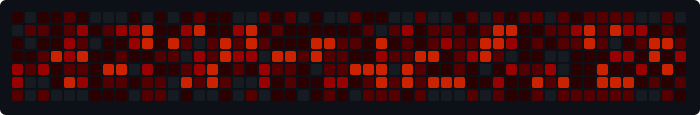

<div align="center">

```
⠀⠀⠀⠀⡀⠀⠀⣀⠀⠀⠀⠀⠀⠀⠀⠀⠀⠀⠀⠀⠀⠀⠀⠀⠀⠀⠀⠀⠀⠀⡀⠀⠀⠀⠀⠀⠀⠀⠀⠀⠀⠀⠀⠀⠀⠀⡀⠀⠀⠀⠀⠀⠀⡀⠀⠀⠀⠀⠀⠀⠀⠀
⠀⢸⠉⣹⠋⠉⢉⡟⢩⢋⠋⣽⡻⠭⢽⢉⠯⠭⠭⠭⢽⡍⢹⡍⠙⣯⠉⠉⠉⠉⠉⣿⢫⠉⠉⠉⢉⡟⠉⢿⢹⠉⢉⣉⢿⡝⡉⢩⢿⣻⢍⠉⠉⠩⢹⣟⡏⠉⠹⡉⢻⡍⡇
⠀⢸⢠⢹⠀⠀⢸⠁⣼⠀⣼⡝⠀⠀⢸⠘⠀⠀⠀⠀⠈⢿⠀⡟⡄⠹⣣⠀⠀⠐⠀⢸⡘⡄⣤⠀⡼⠁⠀⢺⡘⠉⠀⠀⠀⠫⣪⣌⡌⢳⡻⣦⠀⠀⢃⡽⡼⡀⠀⢣⢸⠸⡇
⠀⢸⡸⢸⠀⠀⣿⠀⣇⢠⡿⠀⠀⠀⠸⡇⠀⠀⠀⠀⠀⠘⢇⠸⠘⡀⠻⣇⠀⠀⠄⠀⡇⢣⢛⠀⡇⠀⠀⣸⠇⠀⠀⠀⠀⠀⠘⠄⢻⡀⠻⣻⣧⠀⠀⠃⢧⡇⠀⢸⢸⡇⡇
⠀⢸⡇⢸⣠⠀⣿⢠⣿⡾⠁⠀⢀⡀⠤⢇⣀⣐⣀⠀⠤⢀⠈⠢⡡⡈⢦⡙⣷⡀⠀⠀⢿⠈⢻⣡⠁⠀⢀⠏⠀⠀⠀⢀⠀⠄⣀⣐⣀⣙⠢⡌⣻⣷⡀⢹⢸⡅⠀⢸⠸⡇⡇
⠀⢸⡇⢸⣟⠀⢿⢸⡿⠀⣀⣶⣷⣾⡿⠿⣿⣿⣿⣿⣿⣶⣬⡀⠐⠰⣄⠙⠪⣻⣦⡀⠘⣧⠀⠙⠄⠀⠀⠀⠀⠀⣨⣴⣾⣿⠿⣿⣿⣿⣿⣿⣶⣯⣿⣼⢼⡇⠀⢸⡇⡇⡇
⠀⢸⢧⠀⣿⡅⢸⣼⡷⣾⣿⡟⠋⣿⠓⢲⣿⣿⣿⡟⠙⣿⠛⢯⡳⡀⠈⠓⠄⡈⠚⠿⣧⣌⢧⠀⠀⠀⠀⠀⣠⣺⠟⢫⡿⠓⢺⣿⣿⣿⠏⠙⣏⠛⣿⣿⣾⡇⢀⡿⢠⠀⡇
⠀⢸⢸⠀⢹⣷⡀⢿⡁⠀⠻⣇⠀⣇⠀⠘⣿⣿⡿⠁⠐⣉⡀⠀⠁⠀⠀⠀⠀⠀⠀⠀⠀⠉⠓⠳⠄⠀⠀⠀⠀⠋⠀⠘⡇⠀⠸⣿⣿⠟⠀⢈⣉⢠⡿⠁⣼⠁⣼⠃⣼⠀⡇
⠀⢸⠸⣀⠈⣯⢳⡘⣇⠀⠀⠈⡂⣜⣆⡀⠀⠀⢀⣀⡴⠇⠀⠀⠀⠀⠀⠀⠀⠀⠀⠀⠀⠀⠀⠀⠀⠀⠀⠀⠀⠀⠀⠀⢽⣆⣀⠀⠀⠀⣀⣜⠕⡊⠀⣸⠇⣼⡟⢠⠏⠀⡇
⠀⢸⠀⡟⠀⢸⡆⢹⡜⡆⠀⠀⠀⠀⠀⠀⠀⠀⠀⠀⠀⠀⠀⠀⠀⠀⠀⠀⠀⠀⠀⠀⠀⠀⠀⠀⠀⠀⠀⠀⠀⠀⠀⠀⠀⠀⠀⠀⠀⠀⠀⠀⠀⠀⢠⠋⣾⡏⡇⡎⡇⠀⡇
⠀⢸⠀⢃⡆⠀⢿⡄⠑⢽⣄⠀⠀⠀⢀⠂⠠⢁⠈⠄⠀⠀⠀⠀⠀⠀⠀⠀⠀⠀⠀⠠⠂⠀⠀⠀⠀⠀⠀⠀⠀⠀⠀⠀⠀⡀⠀⠄⡐⢀⠂⠀⠀⣠⣮⡟⢹⣯⣸⣱⠁⠀⡇
⠀⠈⠉⠉⠋⠉⠉⠋⠉⠉⠉⠋⠉⠉⠉⠉⠉⠉⠉⠉⠉⠉⠉⠉⠉⠉⠉⠉⠉⠉⠉⠉⠉⠉⠉⠉⠉⠉⠉⠉⠉⠉⠉⠉⠉⠉⠉⠉⠉⠉⠉⠉⠋⡟⠉⠉⡿⠋⠋⠋⠉⠉⠁
```

<br>

`// the-lust`

<br>


<br><br>

[](https://discord.com/users/nanami.sai)
&nbsp;


</div>

<br>

<table width="100%">
<tr>
<td width="52%" valign="top">

```
// about

⬥  femboy  ·  cosplay  ·  crossdress
⬥  pizza  ·  strawberry boba milk tea
⬥  assassin's creed  ·  cod  ·  gamer
⬥  anime  ·  manga  ·  kdrama  ·  films
⬥  football (soccer)  ·  badminton
⬥  scared of ghosts
─────────────────────────────────────
⬥  rux contributor  ·  tool research
⬥  reverse eng  ·  drm  ·  asm basics
⬥  windows hypervisor research
⬥  c++  >  c#  >  java  >  py  >  rust
⬥  discord  ·  nanami.sai
```

</td>
<td width="48%" valign="top" align="center">

```
⠀⠀⠀⠀⠀⠀⠀⠀⠀⠀⠀⠀⠀⠀⠀⠀⠀⠀⠀⠀⡟⢰⠀⠀⠀⠀⠀⠀⡄⠀⠀⠀⠀⠀⠀⠀⠀⠀⠀⠀⠀⠀⠀⠀⠀⠀⠀⠀
⠀⠀⠀⠀⠀⠀⠀⠀⠀⠀⠀⠀⠀⠀⠀⠀⢡⠠⠀⠀⡇⣯⡄⢀⢀⢰⠢⡀⢣⠘⡄⠀⢀⡀⠀⠀⠀⠀⠀⠀⠀⠀⠀⠀⠀⠀⠀⠀
⠀⠀⠀⠀⠀⠀⠀⠀⠀⠀⠀⠀⠀⣀⠀⠀⠀⢂⠑⡀⡇⢿⠐⡈⠪⠄⣧⣐⣄⠿⡱⢄⠀⢺⠤⢀⢰⣀⠀⠀⠀⠀⠀⠀⠀⠀⠀⠀
⠀⠀⠀⠀⠀⠀⠀⠀⠀⠀⠀⡤⣀⠀⠑⢦⡤⢤⣥⡬⢧⠼⢧⠬⠯⡙⣷⣖⠧⡙⣒⣧⠵⣀⠩⣢⢿⣌⢓⢄⠀⠀⠀⠀⠀⠀⠀⠀
⠀⠀⠀⠀⠀⠀⠀⠀⠀⠀⠐⢄⠳⡌⠙⠡⣍⡓⠦⣌⠭⢬⣤⣡⠐⢎⢼⠷⢞⣼⣬⣱⣽⣲⢫⢻⢕⣍⠣⡱⡽⡲⡠⣀⠀⠀⠀⠀
⠀⠀⠀⠀⠀⠀⠀⠀⡀⢕⡢⢈⠣⡾⢌⡃⠠⢘⣧⣋⠙⠦⡭⢭⡝⠶⣳⠷⢮⣽⣶⣷⣭⣹⢷⡷⣿⣯⣷⡨⢶⣿⣵⢌⡦⡀⠀⠀
⠀⠀⠀⠀⠀⢀⢈⠢⣹⣢⣨⠖⢍⡒⠶⠨⣡⣒⣷⣶⣭⡗⣚⠚⡭⠝⠴⠦⣤⠍⣛⣓⢯⣬⣿⣽⣽⡿⣿⣿⣮⣾⡽⢷⣲⢱⡀⢀
⠀⠀⠀⠀⠀⠈⢋⢼⢽⢯⢦⡙⣓⠞⡛⣳⣙⣾⣭⣧⣄⣀⠤⠐⠒⠉⠊⠙⢛⣿⣟⣯⣾⣭⣻⣮⣻⣿⣿⣿⣿⣿⣦⠘⣞⡌⡿⣼
⠀⠀⠀⠀⠀⠀⠀⣱⢻⡔⢤⣉⣐⣤⣋⣥⡤⣽⡷⠒⠌⡀⢀⣠⡤⠚⢈⣉⡴⠯⠛⠻⢃⢛⣻⣿⣷⣿⣿⡿⣿⣿⣿⣧⣿⣶⣲⢻
⠀⠀⠀⠀⠀⠀⠀⠀⠑⠺⢅⣝⣛⣥⣍⡁⢀⣉⣠⣴⠞⣋⣽⠡⢴⠾⣋⡡⢄⣲⣈⠭⠙⠛⣻⣿⣿⣷⣿⣿⣽⣿⣿⣿⣿⣿⣿⣿
⠀⠀⠀⠀⠀⠀⠀⠒⡤⢤⢶⠚⣋⡩⢤⣖⣍⣉⣾⢋⣬⣛⣷⡿⠋⣨⣕⣦⠓⠁⠀⣀⠴⢎⣉⠵⢛⣻⣩⣽⣿⣿⣿⣿⣿⣿⣋⣟
⠀⠀⠀⠀⠀⠀⠀⠀⣴⣙⡽⣯⡝⣋⣡⣴⣤⢿⢡⣿⣿⡿⢊⣤⠾⠋⡩⠂⢀⣴⡫⠕⣊⠕⢁⠔⢁⡼⠋⠁⡁⣸⣿⣿⣿⣿⣛⣿
⠀⠀⠀⠀⠀⠀⠀⠀⠀⠉⠉⡇⠀⠀⠀⢠⡀⢸⡻⡴⣷⣩⡟⠩⡠⢊⡠⣰⠟⢁⠄⠊⢀⡴⠋⠔⠉⠀⡘⢰⢀⣿⣿⣿⣿⣿⣿⣿
⠀⠀⠀⠀⠀⠀⠀⠀⠀⠀⠀⢡⢠⡄⠀⠀⡘⢩⠗⢪⢋⡟⣐⠥⠶⣹⠼⠑⢈⣀⣴⠜⢁⠀⠀⢠⡕⣽⠀⣟⣾⣿⢻⢻⣿⣿⣿⣿
⠀⠀⠀⠀⠀⠀⠀⠀⠀⢀⣠⠚⡁⠋⠀⠠⡦⠢⠴⢥⣎⣜⣡⣶⣾⣶⣾⣿⣭⣽⣠⠴⢃⣔⣪⡞⣱⣷⠸⣼⣟⣧⣟⣼⣟⣿⣿⣿
⠀⠀⠀⠀⠀⠀⠀⠀⠀⢸⡟⣷⡀⠀⠀⠀⣧⢠⡔⢋⣡⣾⣿⣿⢻⡏⠛⢻⣿⡟⢁⣴⣫⢻⣿⣲⣿⣾⡀⣷⣛⡟⣬⣿⢹⣿⣿⣿
⠀⠀⠀⠀⠀⠀⠀⠀⠀⡾⣛⠻⢿⣦⠀⠀⠈⠈⢡⡜⣿⡿⠟⡿⠃⠀⣄⢳⣿⡿⣿⢿⡿⣿⣽⣿⣿⡿⣧⣿⣿⣷⣿⠛⢸⣿⣿⣿
⠀⠀⠀⠀⠀⠀⠀⠀⠀⣡⠻⡷⣦⡿⠆⠀⠀⢠⣦⠀⢸⡅⠰⠃⠘⣦⡾⣧⡏⡄⢣⡄⣀⣿⣛⣬⡅⣶⣿⣿⣿⣿⢹⡄⣻⣿⣯⣿
⠀⠀⠀⠀⠀⠀⠀⠀⡠⠃⠀⢧⠀⣳⡀⠀⢠⣾⡿⠆⢈⣣⠀⠀⠀⡞⠃⠻⢀⠀⢾⣧⣉⣛⣉⣤⣶⣿⡟⠸⡌⢾⠀⣣⣿⡏⢫⡿
⠀⠀⠀⠀⠀⠀⠀⣾⣀⠀⠀⠙⠃⠘⠃⠠⣼⡇⠀⠀⢨⡖⠀⠀⠀⠁⠀⠀⠈⠁⠈⠻⢿⣿⣿⣿⠟⡹⠶⠁⡓⡘⣆⠿⠡⢠⡏⡿
⠀⠀⠀⠀⠀⠀⠀⠈⠺⢗⣦⣄⣀⠀⠀⠀⠉⠀⠀⠀⠀⠀⠀⠀⠀⠀⣠⠤⠀⠀⠀⠀⣫⣿⣿⣿⠀⢧⢸⠀⡿⢰⢣⢸⡇⡜⣸⣼
```

</td>
</tr>
</table>

<br>

<div align="center">


&nbsp;


<br><br>


</div>

<br>

<div align="center">

</div>

<br>

<div align="center">

</div>
